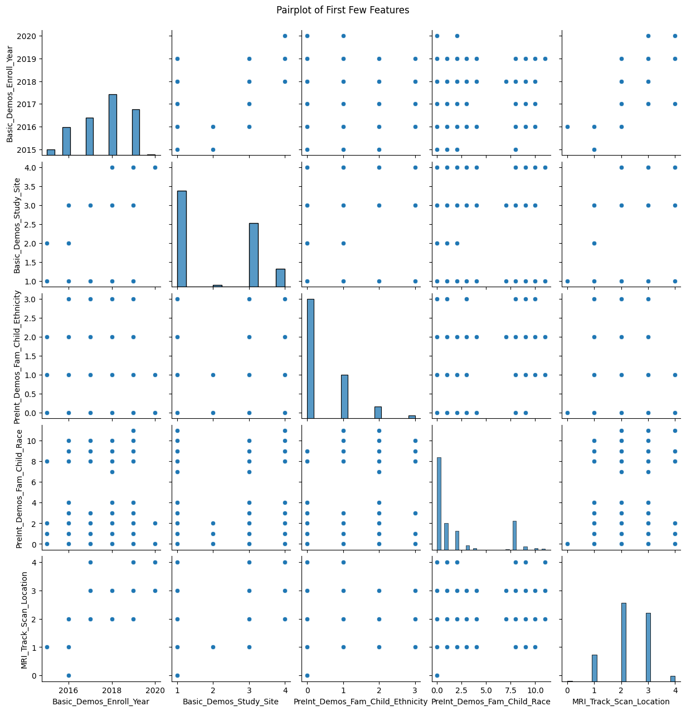
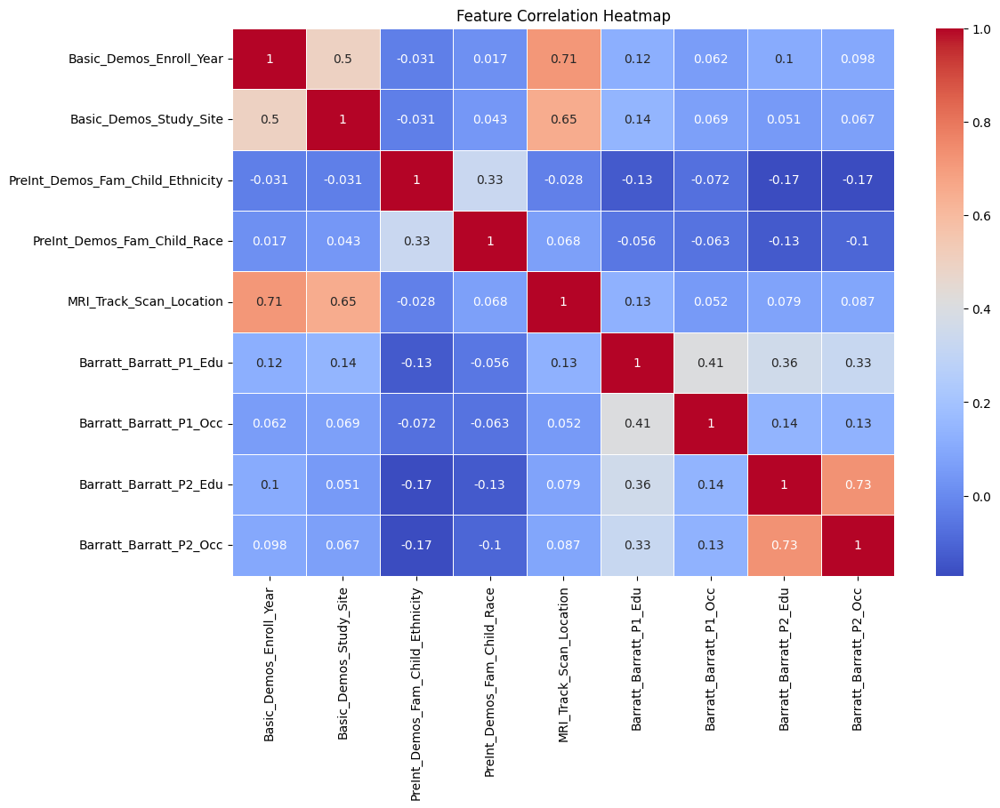

# WiDS-AI-for-Female-Brain-Health---Team-Memory

Team Members

[Supriya Aryal](https://github.com/SupriyaAryal)

[Alyssa King](https://github.com/al8273j)

[Anushka Chokshi](https://github.com/AnushkaChokshi)

[Tamanna Chowdhury](https://github.com/tamannachowdhuryy)

## Project Overview:

The WiDS Datathon 2025 is an annual data science competition that aims to inspire women in data science while tackling a socially impactful problem. This competition is connected to the Break Through Tech AI Program, which supports the advancement of underrepresented individuals in AI and data science.

## Objective of the Challenge

The goal of this challenge is to develop predictive models that leverage brain connectome data to enhance understanding of neurological conditions. Participants must analyze provided datasets and create models that improve upon baseline performance.

## Real-World Significance

Understanding brain connectivity patterns can have profound implications in neuroscience, particularly in diagnosing and treating disorders such as Alzheimer’s, Parkinson’s, and mental health conditions. A well-performing model could aid in early detection and intervention strategies, potentially improving patient outcomes worldwide.

## Data Exploration

Dataset Description

We utilized the official WiDS Datathon 2025 dataset, which includes:

TRAINING_SOLUTIONS.xlsx: Contains the target labels for training data.

TRAIN_FUNCTIONAL_CONNECTOME_MATRICES.csv: Functional connectome data representing brain connectivity.

TRAIN_CATEGORICAL_METADATA.xlsx: Categorical metadata related to each sample.

TRAIN_QUANTITATIVE_METADATA.xlsx: Numerical metadata describing various features of the data.

TEST data follows a similar structure without labels for evaluation.

Data Preprocessing and Exploration

Handling Missing Values: Identified and imputed missing data where necessary.

Feature Engineering: Extracted key features from brain connectivity matrices.

Normalization: Scaled quantitative variables for consistency.

Categorical Encoding: Converted categorical metadata into numerical representations.

Exploratory Data Analysis (EDA)

Our EDA included:

Distribution Analysis: Examined distributions of numerical features.

Correlation Matrix: Analyzed relationships between metadata variables.

Brain Connectivity Visualization: Mapped connectivity matrices to understand structural patterns.

